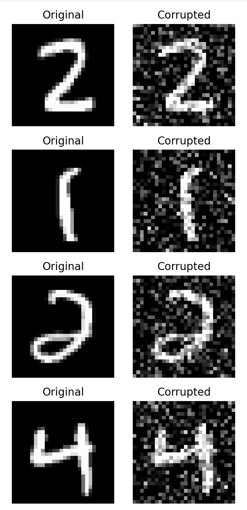
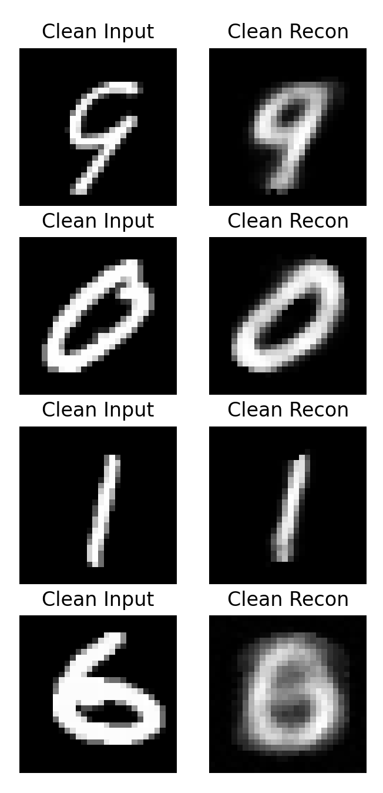
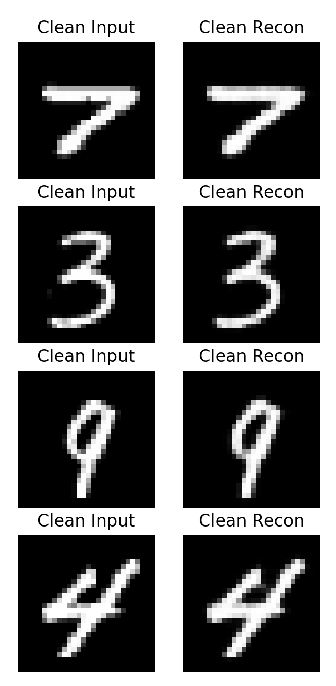
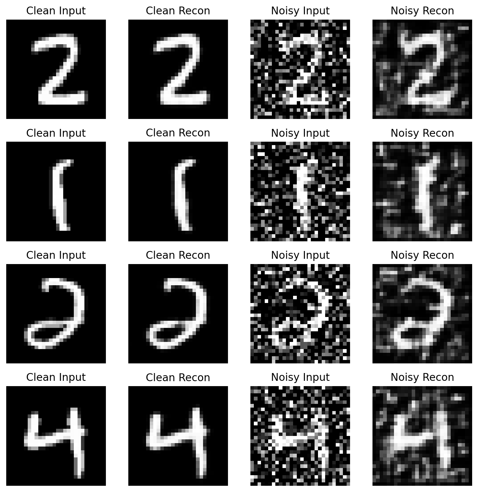

# Autoencoder Anomaly Detection

Small PyTorch playground to compare a simple MLP autoencoder vs. a small convolutional autoencoder on MNIST: reconstruction quality, denoising, and toy anomaly detection via reconstruction error.

## What’s inside
- **MLP autoencoders (baseline + deeper)**  
  Implemented a simple fully-connected autoencoder and a deeper MLP variant to compare capacity vs. reconstruction quality.

- **Convolutional autoencoder**  
  Small conv encoder/decoder that keeps spatial structure (feature maps) instead of flattening early.

- **Noise / corruption pipeline for MNIST**  
  Functions to create corrupted test samples (Gaussian noise) and to compare behavior on:
  clean inputs (seen during training) vs. noisy inputs (out-of-distribution for the model).

- **Reconstruction quality + loss curves**  
  Training/validation loss tracking and plots for different architectures and loss choices.

- **Loss functions: MSE + custom SSIM**  
  Standard pixel-wise MSE, plus a hand-written SSIM loss implementation (no built-in SSIM used).

- **Toy anomaly detection via reconstruction error**  
  Use reconstruction MSE as an anomaly score: plot error distributions (clean vs. corrupted), pick a threshold, and report confusion matrix + precision/recall/F1.

## Setup
    pip install -r requirements.txt

Run scripts from the repo root.

## Scripts
### Train
    python scripts/train.py

Edit the config block at the top (model type, loss, epochs, lr, seed, etc.).
Saves a checkpoint (conv_autoencoder.pth / mlp_autoencoder.pth, ignored by git).

### Visualize corruption level
    python scripts/visualize_corrupted.py

### Reconstructions demo (clean + noisy)
    python scripts/demo_reconstruction.py

### Reconstruction error + anomaly detection
    python scripts/reconstruction_error.py

Computes reconstruction MSE for clean vs. corrupted test samples, prints TP/TN/FP/FN, plots the confusion matrix, and shows error histograms.
Tune THRESHOLD, NOISY_FRACTION, NOISE_LEVEL, MODEL_TYPE, SEED in the config block.

## Results (plots)
### Original vs. corrupted

## Results (quick visual)

**MLP autoencoder (left) vs. Conv autoencoder (right)**  

  
  
  

**Clean vs. noisy reconstruction (comparison)**  

  

## Notes / takeaways
- The Conv autoencoder reconstructs MNIST digits cleaner and is more robust to noise than the MLP.
- Thresholding reconstruction error works as a simple anomaly detector:
  moderate noise -> overlap (meaningful trade-off), heavy noise -> trivial separation.

## Project structure
- scripts/ – training, demos, corruption visualization, thresholding + metrics
- autoencoder.py, conv_autoencoder.py – model definitions
- ssim_loss.py – SSIM loss implementation (no built-in SSIM used)
- data.py, helpers.py – MNIST loading + noise helpers
- bilder_autoencoder/ – figures for README

