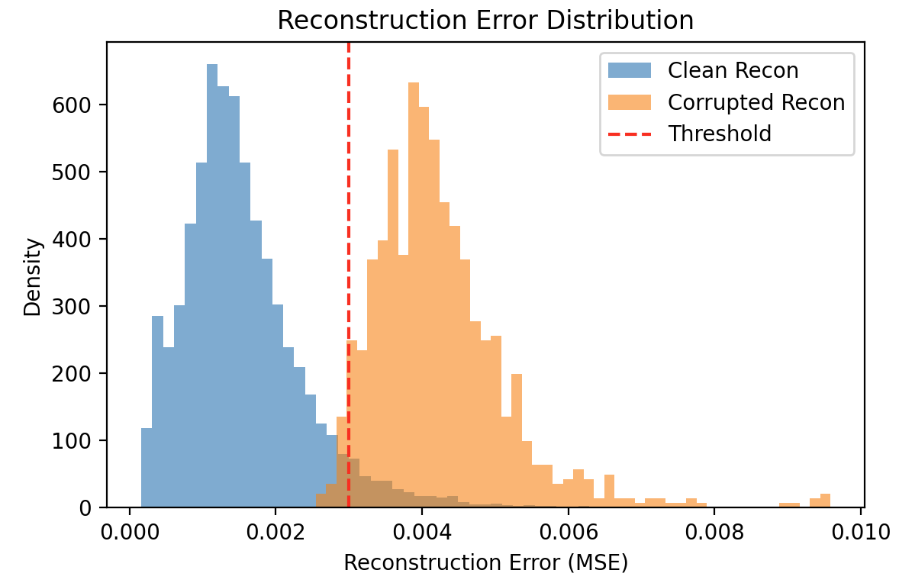
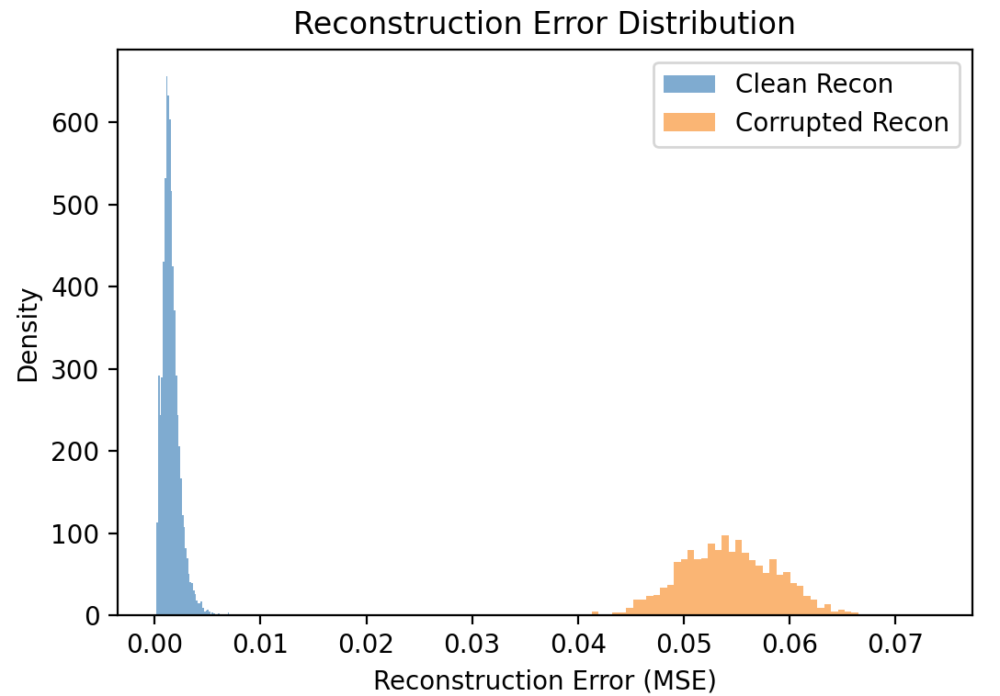

# MNIST Autoencoders: MLP vs Conv + Reconstruction-Error Anomaly Detection

## What’s inside
- **MLP autoencoders (baseline + deeper)**  
  Implemented a simple fully-connected autoencoder and a deeper MLP variant to compare capacity vs. reconstruction quality.

- **Convolutional autoencoder**  
  Small conv encoder/decoder that keeps spatial structure (feature maps) instead of flattening early.

- **Noise / corruption pipeline for MNIST**  
  Functions to create corrupted test samples (Gaussian noise) and to compare behavior on:
  clean inputs (seen during training) vs. noisy inputs (out-of-distribution for the model).

- **Reconstruction quality + loss curves**  
  Training/validation loss tracking and plots for different architectures and loss choices.

- **Loss functions: MSE + custom SSIM**  
  Standard pixel-wise MSE, plus a hand-written SSIM loss implementation (no built-in SSIM used).

- **Toy anomaly detection via reconstruction error**  
  Use reconstruction MSE as an anomaly score: plot error distributions (clean vs. corrupted), pick a threshold, and report confusion matrix + precision/recall/F1.

## Setup
    pip install -r requirements.txt

Run scripts from the repo root.

## Scripts
### Train
    python scripts/train.py

Edit the config block at the top (model type, loss, epochs, lr, seed, etc.).
Saves a checkpoint (conv_autoencoder.pth / mlp_autoencoder.pth, ignored by git).

### Visualize corruption level
    python scripts/visualize_corrupted.py

### Reconstructions demo (clean + noisy)
    python scripts/demo_reconstruction.py

### Reconstruction error + anomaly detection
    python scripts/reconstruction_error.py

Computes reconstruction MSE for clean vs. corrupted test samples, prints TP/TN/FP/FN, plots the confusion matrix, and shows error histograms.
Tune THRESHOLD, NOISY_FRACTION, NOISE_LEVEL, MODEL_TYPE, SEED in the config block.

## Results (quick visual)

**Original vs. corrupted MNIST pictures**

*What you see:* Adding Gaussian noise makes the digits less readable and pushes them away from the clean MNIST distribution.  
The noise level is basically a “difficulty knob”: more noise → harder reconstruction + easier anomaly separation; less noise → more overlap + more realistic thresholding.

---

**MLP autoencoder (left) vs. Conv autoencoder (right)**  

  
  
  

*What you see:* The conv autoencoder generally keeps strokes and edges cleaner (less “washed out” / blurry) than the MLP.  
Makes sense because the conv model preserves spatial structure with feature maps instead of flattening early.

---

**Clean vs. noisy reconstruction (comparison)**  

  

*What you see:* On clean inputs (seen during training), reconstructions are almost perfect. On noisy inputs, reconstruction quality drops a lot — even for the conv model — because the network wasn’t trained to model the corrupted distribution.  
That gap in reconstruction error is exactly what gets used for the anomaly score later.

### Reconstruction error distributions (clean vs. corrupted)
To turn the autoencoder into a simple anomaly detector, I use the **reconstruction MSE** as an anomaly score:  
clean digits (in-distribution) should reconstruct with **low error**, while corrupted digits should reconstruct with **higher error**.

I plotted the error distributions for **two noise levels**:

  
  

*Left:* moderate noise → more overlap (threshold trade-off).  
*Right:* high noise → near-perfect separation.

**What you can see:**  
With **high noise**, the corrupted-error distribution shifts far to the right, so clean vs. corrupted is easy to separate.  
With **lower noise**, the distributions overlap more, so choosing a threshold becomes a real trade-off (more false positives vs. more false negatives).

## Notes / takeaways
- **Conv beats MLP on images.** Keeping the spatial layout (feature maps + pooling) gives noticeably sharper reconstructions and a much lower validation MSE than the fully-connected models.
- **Depth didn’t help much for the MLP here.** The deeper MLP wasn’t consistently better than the shallow one (MNIST is simple, and with plain SGD the deeper network is harder to optimize).
- **MSE vs. SSIM feels different.** MSE is great for stable optimization and low numeric loss, while SSIM tends to care more about “shape/structure” (sometimes nicer-looking digits even if the loss values aren’t directly comparable).
- **Anomaly detection is basically thresholding an error score.** Reconstruction MSE works as a toy anomaly score: clean digits cluster at low error, corrupted digits shift right.
- **Noise level controls difficulty.** With heavy noise you get near-perfect separation (easy but boring). With moderate noise the distributions overlap, and the threshold becomes a real precision/recall trade-off (more FP vs. more FN).

## Project structure
- scripts/ – training, demos, corruption visualization, thresholding + metrics
- autoencoder.py, conv_autoencoder.py – model definitions
- ssim_loss.py – SSIM loss implementation (no built-in SSIM used)
- data.py, helpers.py – MNIST loading + noise helpers
- bilder_autoencoder/ – figures for README

